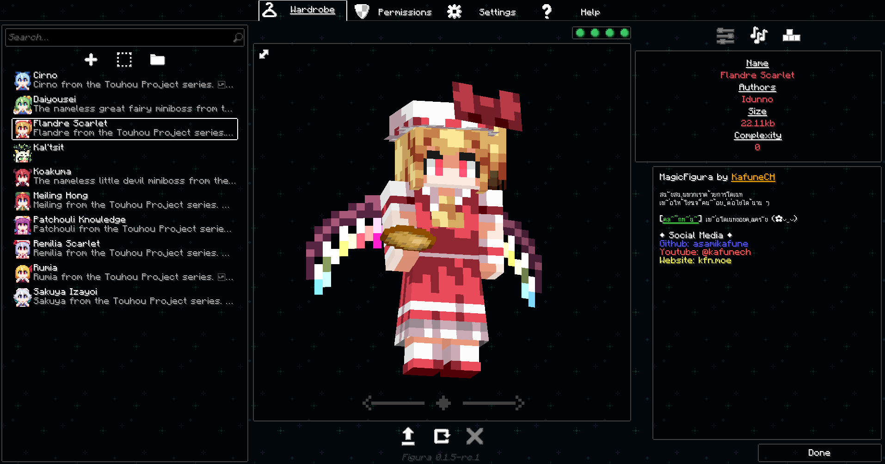

# MAGICFIGURA
Alt Emulator FiguraBackend V2 for selfhost

## Features

- Upload avatar
- Get Avatar
- Get Player
- Ban, Unban
- Whitelist
- fully config
- Noti (alert toast, chat)
- Support Figura version 1.1+

## KnowBug

- in config.js when you set multiinstant = true sometime avatar is not update

## Preview




## ✨Deployment

To deploy backend (please use cloudflare tunnel or something for make Verify SSL)

```bash
  npm install
  node .
```

## ✨Please

If you use it on your server please credit me KafuneCH.

## Tech Stack
**Server:** Node, websocket, fastify

## Support

For support, You can donate me @ https://donate.kfn.moe/d/kafunech. (Thai bank only.)

## Message from me

I know my code is not good but it work! who care?